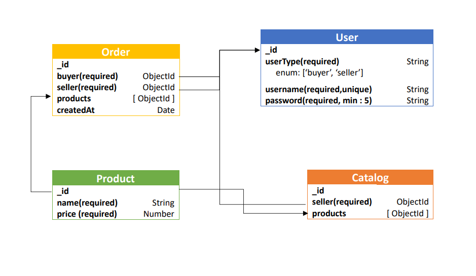

# E-Commerce backend

Experience a unified e-commerce hub – my Node.js backend, seamlessly catering to buyers and sellers. Leveraging Node.js, it ensures a secure, feature-rich marketplace for all.

## Tech Stack
&nbsp;
&nbsp;
&nbsp;
&nbsp;

## How to run
 First create a .env file using the data given in envinfo.txt file.
```sh 
node server.js
```
## Features
- Buyers and sellers can register and login to the system
- Sellers can build a catalog of items, with each item having a name and price
- Buyers can GET a list of sellers
- Buyers can GET a specific seller's catalog (list of items)
- Buyers can create an Order that contains a list of items from the seller's catalog
- Sellers can GET a list of all orders they've received

## Database Schema


## APIs

### 1. Auth APIs
 **POST ```/api/auth/register```**
-  Register a user
-  **How to call :** pass userType,  username and password in the body
 **Example** : 
userType : seller
username : abcd
password : 123456

 **POST ```/api/auth/register```**
-  Let a previously registered user
-  **How to call :** pass username and password in the body
 **Example** : 
username : abcd
password : 123456

### 2.APIs for buyers(Only buyers can access it)
 **GET ```/api/buyer/list-of-sellers```**
-  Get a list of sellers.
-  **How to call :** simply call the API

 **GET ```/api/buyer/seller-catalog/:seller_id```**
-  Get the catalog of a seller by seller_id.
-  **How to call :** pass seller_id in the params.

**POST ```/api/buyer/create-order/:seller_id```**
-  Sends a list of items to create an order for seller with id = seller_id.
-  **How to call :** 
    pass seller_id in the params. 
    pass the list of names of products in the body.
**Example:** {
  "products": [
    "Macbook Pro M2",
    "Boat Rockerz 335"
  ]
}

### 3.APIs for sellers(Only sellers can access it)
 **POST ```/api/seller/create-catalog```**
-  Seller sends a list of items to create a catalog or add more products in the catalog.
-  **How to call :**  pass a list of names and prices of products.
-  **Example:** {
  "items": [
    {
      "name": "Macbook Pro M2",
      "price": 93000
    },
    {
      "name": "Galaxy S21 Ultra",
      "price": 70000
    },
    {
      "name": "Boat Rockerz 335",
      "price": 3000
    }
  ]
}

 **GET ```/api/seller/orders```**
-  Retrives the list of orders recieved by a seller .
-  **How to call :** simply call the API.


